# OmniShopAgent

An intelligent multi-modal e-commerce search agent powered by LLMs, RAG, and visual understanding for fashion product discovery.

## Overview

OmniShopAgent combines Retrieval-Augmented Generation (RAG), multi-modal search, and conversational AI to create an intelligent shopping assistant. The system understands both text and image queries, maintains conversation context, and intelligently routes requests to appropriate processing pipelines.

**Key Features:**
- Multi-modal search (text and image queries)
- Conversational memory and context tracking
- Intelligent query routing with LangChain agents
- Intent classification and boundary handling
- ReAct pattern for complex multi-step reasoning
- Hybrid retrieval strategies (vector + metadata filtering)

## Tech Stack

| Component | Technology | Purpose |
|-----------|-----------|---------|
| **LLM** | GPT-4o-mini (OpenAI) | Agent reasoning, VLM analysis, response generation |
| **Text Embedding** | text-embedding-3-small (OpenAI) | Product description vectorization (1536-dim) |
| **Image Embedding** | CLIP ViT-B/32 (Local) | Visual similarity search (512-dim) |
| **Vector Database** | Milvus Lite | Efficient similarity search for text & image vectors |
| **Metadata Store** | MongoDB | Product attributes (price, color, category, etc.) |
| **Session Store** | Redis | Conversation history and user context |
| **Backend Framework** | FastAPI | RESTful API with async support |
| **Agent Framework** | LangChain | Tool orchestration and ReAct loop implementation |

## Dataset

Uses the **Fashion Product Images Dataset** from Kaggle (~44,000 products with attributes like color, category, gender, season, usage).

Download: `kaggle datasets download -d paramaggarwal/fashion-product-images-dataset`

## Architecture

```mermaid
graph TD
    %% --- 1. Core Components ---
    subgraph UserInput
        User["User<br/>(Identified by <b>Session ID</b>)"] 
    end
    
    subgraph ApplicationLayer
        API["<b>FastAPI Backend</b><br/>(Receives query + Session ID + optional image)"] 
    end
    
    subgraph OrchestrationLayer
        Agent["<b>Agent (LLM Router)</b><br/>Model: GPT-4o-mini<br/>Framework: LangChain<br/><i>'Which flow should I execute?'</i>"]
    end
    
    subgraph Tools
        T1["<b>Tool 1: VLM Reasoning</b><br/>GPT-4o-mini with Vision<br/><i>'Analyze image style/attributes'</i>"]
        T2["<b>Tool 2: Visual Search</b><br/>CLIP ViT-B/32 (Local)<br/><i>'Find visually similar products'</i>"]
        T3["<b>Tool 3: Text Search (RAG)</b><br/>text-embedding-3-small<br/><i>'Semantic text retrieval'</i>"]
    end

    subgraph DataStores[Data Stores]
        Milvus[("<b>Vector DB (Milvus Lite)</b><br/>- Image Embeddings (512-dim)<br/>- Text Embeddings (1536-dim)<br/>~44k products")]
        Mongo[("<b>Metadata DB (MongoDB)</b><br/>- Product attributes<br/>- Price, color, category, etc.")]
        History[("<b>Session DB (Redis)</b><br/>- Chat history per Session ID<br/>- Conversation context")] 
    end

    %% --- 2. Start Flow ---
    User --> API
    API -- "Current Query + Session ID" --> IntentCheck["<b>Flow 0: Intent Classification</b><br/>- Out-of-scope?<br/>- Too vague?<br/>- Chitchat?<br/>- No match?"]
    
    IntentCheck -- "Boundary Case" --> BoundaryHandler["<b>Boundary Handler</b><br/>- Polite refusal<br/>- Ask clarification<br/>- Suggest alternatives<br/>- Casual response"]
    BoundaryHandler --> API
    
    IntentCheck -- "Valid Search Query" --> Agent
    History -- "Past Conversation<br/>(using Session ID as Key)" --> Agent 
    
    %% --- 3. Agent routes to different workflows ---

    %% --- Flow 1: Text RAG ---
    subgraph Flow1 ["Flow 1: Text RAG (e.g., 'a 100% cotton blue shirt')"]
        direction LR
        Agent -- "<b>Flow 1</b>" --> F1_Start(T3: Text Search)
        F1_Start -- "1. Query Vector" --> Milvus
        Milvus -- "2. Return Top K 'noisy' IDs<br/>(incl. 'Red Cotton Shirt')" --> F1_GetMongo
        F1_GetMongo["Get Metadata"] --> Mongo
        Mongo -- "3. Return K 'noisy' Data Objects" --> F1_Augment
        F1_Augment["<b>Context Augmentation</b><br/>(Pass K results to LLM)"] --> F1_Generate
        F1_Generate["<b>Generation (Reasoning)</b><br/>LLM <b>reasons & filters</b> 'Red Shirt',<br/>then generates the answer"] --> API
    end

    %% --- Flow 2: Pure Visual Search ---
    subgraph Flow2 ["Flow 2: Pure Visual Search (e.g., [image] + 'find similar')"]
        direction LR
        Agent -- "<b>Flow 2</b>" --> F2_Start(T2: Visual Search)
        F2_Start -- "1. Image Vector" --> Milvus
        Milvus -- "2. Return Top K 'trusted' IDs" --> F2_GetMongo
        F2_GetMongo["Get Metadata"] --> Mongo
        Mongo -- "3. Return K 'trusted' Data Objects" --> F2_Augment
        F2_Augment["<b>Context Augmentation</b><br/>(Pass K results to LLM)"] --> F2_Generate
        F2_Generate["<b>Generation (Presenting)</b><br/>LLM <b>presents</b> trusted results<br/>(no filtering needed)"] --> API
    end
    
    %% --- Flow 3: Visual Search + Metadata Filter ---
    subgraph Flow3 ["Flow 3: Visual Search + Filter (e.g., [image] + '...but in blue')"]
        direction LR
        Agent -- "<b>Flow 3</b>" --> F3_Start(T2: Visual Search)
        F3_Start -- "1. Image Vector" --> Milvus
        Milvus -- "2. Return Top 100 IDs" --> F3_FilterMongo
        F3_FilterMongo["<b>Database Filter (MongoDB)</b><br/>(Query: WHERE ID IN [...]<br/>AND color == 'blue')"] --> Mongo
        Mongo -- "3. Return 3 'filtered' Data Objects" --> F3_Augment
        F3_Augment["<b>Context Augmentation</b><br/>(Pass 3 filtered results to LLM)"] --> F3_Generate
        F3_Generate["<b>Generation (Presenting)</b><br/>LLM formats the 3 results<br/>and generates the answer"] --> API
    end
    
    %% --- Flow 4: ReAct Loop (VLM -> RAG Chain) ---
    subgraph Flow4 ["Flow 4: ReAct Loop (e.g., [image] + 'find me cocktail dresses in this style')"]
        direction LR
        Agent -- "<b>Flow 4</b>" --> F4_Reason1["<b>Turn 1: Reason</b><br/>'I need the style first.<br/>I must call Tool 1 (VLM).'"]
        F4_Reason1 --> F4_Act1["<b>Turn 1: Act</b><br/>Call T1 (VLM)"]
        F4_Act1 --> T1
        T1 -- "<b>Observation:</b><br/>'Black A-line cocktail dress with lace'" --> F4_Reason2
        F4_Reason2["<b>Turn 2: Reason</b><br/>'OK, style is cocktail A-line.<br/>I must now call Tool 3 (RAG)<br/>to find similar cocktail dresses.'"]
        F4_Reason2 --> F4_Act2["<b>Turn 2: Act</b><br/>Call T3 (Text RAG)<br/>with new query"]
        F4_Act2 --> F4_RAGFlow("RAG Sub-Flow<br/>(Runs full Flow 1)")
        F4_RAGFlow -- "Final Answer" --> API
    end

    %% --- Flow 5: Conversational Memory ---
    subgraph Flow5 ["Flow 5: Conversational Memory (e.g., 'find matching shoes')"]
        direction LR
        Agent -- "<b>Flow 5</b>" --> F5_Reason["<b>Reason (with Memory)</b><br/>'Query is find matching shoes.<br/><b>Get history for Session ID.</b><br/>History says we just<br/>discussed 'casual white sneakers'.<br/>I must call Tool 3 (RAG).'"] 
        F5_Reason --> F5_Act["<b>Act</b><br/>Call T3 (Text RAG)<br/>with query:<br/>'casual white shoes for men'"]
        F5_Act --> F5_RAGFlow("RAG Sub-Flow<br/>(Runs full Flow 1)")
        F5_RAGFlow -- "Final Answer" --> API
    end
    
    %% --- 4. Final Response ---
    API -- "Final Answer" --> FinalResponse["User Response"]
    API -- "Save conversation<br/>(using Session ID as Key)" --> History 

    %% --- Style Definitions ---
    classDef default fill:#f9f9f9,stroke:#333,stroke-width:2px;
    class Agent fill:#e6f7ff,stroke:#0056b3,stroke-width:2px;
    class IntentCheck,BoundaryHandler fill:#fff0e6,stroke:#ff8c00,stroke-width:2px;
    class T1,T2,T3 fill:#fffbe6,stroke:#b8860b,stroke-width:2px;
    class Milvus,Mongo,History fill:#e6ffe6,stroke:#006400,stroke-width:2px;
    class API,FinalResponse fill:#f0e6ff,stroke:#663399,stroke-width:2px;
    class F1_Generate,F4_RAGFlow,F5_RAGFlow fill:#ffebeb,stroke:b30000;
    class F2_Generate,F3_Generate fill:#ebfbee,stroke:006400;
    class F4_Reason1,F4_Act1,F4_Reason2,F4_Act2,F5_Reason,F5_Act fill:f5f5f5,stroke:444;
```



## Workflows

### Flow 0: Intent Classification & Boundary Handling
The system performs intent classification before executing search flows to handle edge cases and guide users.

**Handled Cases:**

**1. Out-of-Scope Queries**
- Query: *"I want to buy a phone"* or *"Recommend some furniture"*
- Response: Politely explain focus on fashion products and suggest valid categories
- Example: "I specialize in fashion products like clothing, shoes, and accessories. Can I help you find any fashion items today?"

**2. Too Vague Queries**
- Query: *"Recommend something"* or *"I want to buy something"* or *"Give me a complete date outfit"*
- Response: Ask for clarification with specific suggestions
- Example: "I'd love to help! Could you specify what type of item you're looking for? For example: 'Show me blue casual dresses' or 'I need formal shoes for a wedding'"

**3. No Close Match in Dataset**
- Query: *"I want a pure gold shirt"* (not in dataset)
- Process: Check similarity score threshold (< 0.6)
- Response: Suggest broader alternatives
- Example: "I couldn't find exact matches for a gold shirt. Would you like to see elegant metallic-tone shirts or gold accessories instead?"

**4. Chitchat**
- Query: *"Hello"*, *"Thank you"*, *"How are you"*
- Response: Engage naturally and transition to shopping assistance
- Example: "Hello! Nice to meet you. I can help you find fashion products. What are you looking for today?"

Intent classification uses LLM to categorize queries as: `specific_search`, `too_vague`, `out_of_scope`, or `chitchat`.

### Flow 1: Text-Based RAG Search
**Query Example**: *"I need a 100% cotton blue shirt for casual wear"*

**Process**:
1. Convert query to 1536-dim vector using `text-embedding-3-small`
2. Search Milvus for top-K similar product descriptions
3. Fetch full metadata from MongoDB for retrieved products
4. GPT-4o-mini filters results based on exact requirements
5. Generate natural language response

Text embeddings capture semantic similarity but may retrieve noisy results. LLM reasoning filters false positives.

### Flow 2: Pure Visual Search
**Query Example**: *[Upload image of a dress] + "Find similar items"*

**Process**:
1. CLIP model converts image to 512-dim vector
2. Search Milvus image collection for visually similar products
3. Fetch metadata for retrieved products
4. Present results with style descriptions

CLIP embeddings provide accurate visual similarity without additional filtering.

### Flow 3: Visual Search + Attribute Filtering
**Query Example**: *[Upload image] + "Find similar but in red color"*

**Process**:
1. CLIP finds top-100 visually similar items
2. MongoDB query filters by `WHERE id IN [...] AND color = 'red'`
3. Return filtered results
4. Format final answer

Combines visual similarity with structured filtering to avoid hallucination.

### Flow 4: ReAct Loop (VLM → RAG Chain)
**Query Example**: *[Upload image of a formal dress] + "Find me similar cocktail dresses"*

**Process** (ReAct pattern):
1. **Reasoning Turn 1**: Agent identifies need to analyze dress style first
2. **Action Turn 1**: VLM analyzes image → "This is a black A-line cocktail dress with lace details"
3. **Observation**: Style identified as formal cocktail wear with lace
4. **Reasoning Turn 2**: Use extracted attributes for text search
5. **Action Turn 2**: Text RAG search for "black cocktail dress A-line lace"
6. **Final Answer**: Present refined results

Multi-step reasoning decomposes complex queries through agent orchestration.

### Flow 5: Conversational Memory
**Query Sequence**:
- *Turn 1*: "Show me casual white sneakers for men"
- *Turn 2*: "Now find a matching backpack"

**Process**:
1. Retrieve conversation from Redis using Session ID
2. Agent understands context from previous turn
3. Transform "matching backpack" → "casual white backpack for men"
4. Execute Text RAG with augmented query
5. Save new turn to Redis

Maintains context across turns for natural multi-turn conversations.

## Installation

**Prerequisites:**
- Python 3.11+
- OpenAI API Key
- MongoDB (local or Docker)
- CLIP Server (for image embeddings)

**Quick Start:**

See **[QUICKSTART.md](QUICKSTART.md)** for a 5-minute setup guide.

**Detailed Setup:**

1. **Clone and install dependencies**
```bash
cd OmniShopAgent
python -m venv venv
source venv/bin/activate  # macOS/Linux
pip install -r requirements.txt
```

2. **Configure environment**
Create a `.env` file with your configuration:
```bash
# Required
OPENAI_API_KEY=your_api_key_here

# MongoDB
MONGO_URI=mongodb://localhost:27017

# Milvus (uses embedded Milvus Lite by default)
MILVUS_URI=./data/milvus_lite.db

# See SETUP.md for all configuration options
```

3. **Start required services**
```bash
# MongoDB
brew services start mongodb-community  # macOS
# or
docker run -d -p 27017:27017 --name mongodb mongo:latest

# CLIP Server (in a separate terminal)
cd ~/Documents/clip
python -m clip_server torch-flow.yml
```

4. **Import data and create indexes**
```bash
# Import product data to MongoDB
python scripts/import_to_mongodb.py --clear

# Generate and store embeddings
python scripts/index_data.py --mode both

# Test all services
python scripts/test_services.py
```

**Quick Test:**
```python
from app.services import get_mongodb_service, get_embedding_service, get_milvus_service

# Test the services
mongo = get_mongodb_service()
print(f"Products: {mongo.count_products()}")

embed = get_embedding_service()
emb = embed.get_text_embedding("blue jeans")
print(f"Embedding dimension: {len(emb)}")

milvus = get_milvus_service()
stats = milvus.get_collection_stats("text_embeddings")
print(f"Text embeddings: {stats['row_count']}")
```

## Documentation

- **[QUICKSTART.md](QUICKSTART.md)** - 5-minute setup guide
- **[SETUP.md](SETUP.md)** - Detailed setup instructions
- **[docs/SERVICES.md](docs/SERVICES.md)** - Service layer documentation

## Project Structure

```
OmniShopAgent/
├── app/
│   ├── config.py              # Configuration management
│   ├── api/
│   │   └── __init__.py        # API endpoints (coming soon)
│   ├── agents/
│   │   └── __init__.py        # Agent implementations (coming soon)
│   └── services/              # ✅ Service layer (completed)
│       ├── __init__.py        # Service exports
│       ├── mongodb_service.py # Product metadata storage
│       ├── embedding_service.py # Text & image embeddings (OpenAI + CLIP)
│       └── milvus_service.py  # Vector storage & similarity search
├── scripts/
│   ├── download_dataset.py    # Download fashion dataset
│   ├── import_to_mongodb.py   # ✅ Import data to MongoDB
│   ├── index_data.py          # ✅ Generate and store embeddings
│   └── test_services.py       # ✅ Test all services
├── data/
│   ├── styles.csv             # Product metadata
│   ├── images.csv             # Image URLs
│   ├── images/                # Product images (~44k)
│   └── milvus_lite.db         # Embedded vector database
├── docs/
│   └── SERVICES.md            # Service layer documentation
├── tests/
├── requirements.txt
├── QUICKSTART.md              # 5-minute setup guide
├── SETUP.md                   # Detailed setup instructions
└── README.md
```

## Current Status

### ✅ Completed
- **Service Layer**: MongoDB, Embedding (OpenAI + CLIP), and Milvus services
- **Data Pipeline**: Import scripts and indexing tools
- **Testing**: Comprehensive service tests

### 🚧 In Progress
- **LangChain Tools**: Product search tools
- **Agent Layer**: Conversational agent with ReAct pattern
- **API Layer**: FastAPI endpoints
- **UI Layer**: User interface

### 📋 Next Steps
1. Develop LangChain tools for product search
2. Implement agent with tool orchestration
3. Build FastAPI application
4. Create user interface

## License

MIT License - see [LICENSE](LICENSE) for details