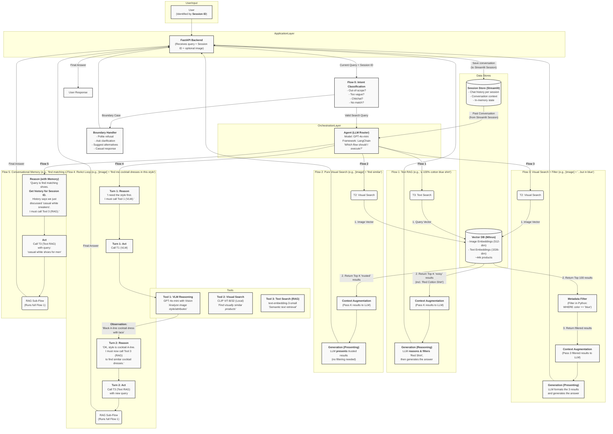

# OmniShopAgent

An intelligent multi-modal e-commerce search agent powered by LLMs, RAG, and visual understanding for fashion product discovery.

## Overview

OmniShopAgent combines Retrieval-Augmented Generation (RAG), multi-modal search, and conversational AI to create an intelligent shopping assistant. The system understands both text and image queries, maintains conversation context, and intelligently routes requests to appropriate processing pipelines.

**Key Features:**
- Multi-modal search (text and image queries)
- Conversational memory and context tracking
- Intelligent query routing with LangChain agents
- Intent classification and boundary handling
- ReAct pattern for complex multi-step reasoning
- Hybrid retrieval strategies (vector + metadata filtering)

## Tech Stack

| Component | Technology | Purpose |
|-----------|-----------|---------|
| **LLM** | GPT-4o-mini | Agent reasoning, VLM analysis, response generation |
| **Text Embedding** | text-embedding-3-small| Product description vectorization |
| **Image Embedding** | CLIP ViT-B/32 | Visual similarity search |
| **Vector Database** | Milvus Lite | Efficient similarity search for text & image vectors (embedded) |
| **Frontend** | Streamlit | Interactive web interface |
| **Agent Framework** | LangChain | Tool orchestration and flow routing |

## Dataset

Uses the **Fashion Product Images Dataset** from Kaggle (~44,000 products with attributes like color, category, gender, season, usage).

Download: `kaggle datasets download -d paramaggarwal/fashion-product-images-dataset`

## Architecture



## Workflows

### Flow 0: Intent Classification & Boundary Handling
Classifies user intent before search execution to handle edge cases:
- **Out-of-Scope**: Non-fashion queries → Redirect to valid categories
- **Too Vague**: Unclear requests → Ask for clarification
- **Chitchat**: Greetings/casual talk → Engage and guide to shopping
- **Specific Search**: Valid queries → Route to Flows 1-4

LLM categorizes queries into: `specific_search`, `too_vague`, `out_of_scope`, or `chitchat`.

### Flow 1: Text-Based RAG Search
**Example**: *"Blue cotton shirt for casual wear"*

Text → Embedding → Milvus search → LLM filtering → Response

Text embeddings may be noisy; LLM filters false positives.

### Flow 2: Pure Visual Search
**Example**: [Image] + *"Find similar items"*

Image → CLIP embedding → Milvus search → Direct results

CLIP provides accurate visual similarity without filtering.

### Flow 3: Visual Search + Attribute Filtering
**Example**: [Image] + *"Similar but in red"*

Image → CLIP → Top-100 results → Metadata filter → Filtered results

Combines visual similarity with attribute constraints.

### Flow 4: ReAct Loop (VLM → RAG)
**Example**: [Image] + *"Find cocktail dresses in this style"*

Image → VLM analysis (style/attributes) → Text search with extracted attributes → Results

Multi-step reasoning: analyze style first, then search by description.

### Flow 5: Conversational Memory
**Example**: 
- Turn 1: *"Show me white sneakers"*
- Turn 2: *"Now find a matching backpack"* → Uses context from Turn 1

Retrieves chat history → Understands context → Augments query → Execute search

Enables natural multi-turn conversations via Streamlit session state.

## Installation

**Prerequisites:**
- Python 3.11+ or 3.13+
- OpenAI API Key
- Docker & Docker Compose (for Milvus)

**Quick Start:**

### 1. Clone and Install Dependencies
```bash
git clone <repository-url>
cd OmniShopAgent
python -m venv venv
source venv/bin/activate  # On Windows: venv\Scripts\activate
pip install -r requirements.txt
```

### 2. Configure Environment
Create a `.env` file in the project root:
```bash
OPENAI_API_KEY=your_openai_api_key_here
CLIP_SERVER_URL=grpc://localhost:51000
```

### 3. Download Dataset
```bash
# Option 1: Use Kaggle CLI (requires Kaggle account)
kaggle datasets download -d paramaggarwal/fashion-product-images-dataset
unzip fashion-product-images-dataset.zip -d data/

# Option 2: Use download script
python scripts/download_dataset.py
```

The dataset should be extracted to `./data/` with the following structure:
```
data/
├── images/       # Product images
├── styles.csv    # Product metadata
└── images.csv    # Image paths
```

### 4. Start Required Services

**Terminal 1 - Start Milvus Vector Database:**
```bash
docker-compose up
```

Wait until you see `Milvus Proxy started successfully` in the logs.

**Terminal 2 - Start CLIP Server:**
```bash
# Install CLIP server if not already installed
pip install clip-server

# Start CLIP server on port 51000
python -m clip_server
```

The CLIP server will start at `grpc://0.0.0.0:51000` by default.

### 5. Index Product Data (One-time Setup)
In a new terminal:
```bash
source venv/bin/activate  # Activate virtual environment

# Generate and store embeddings in Milvus
# This will take ~10-15 minutes for 44k products
python scripts/index_data.py
```

You should see progress like:
```
Processing batch 1/440...
Processing batch 2/440...
...
Indexing complete! Indexed 44,000 products.
```

### 6. Launch the Application
```bash
streamlit run app.py
```

The app will automatically open in your browser at `http://localhost:8501` 


