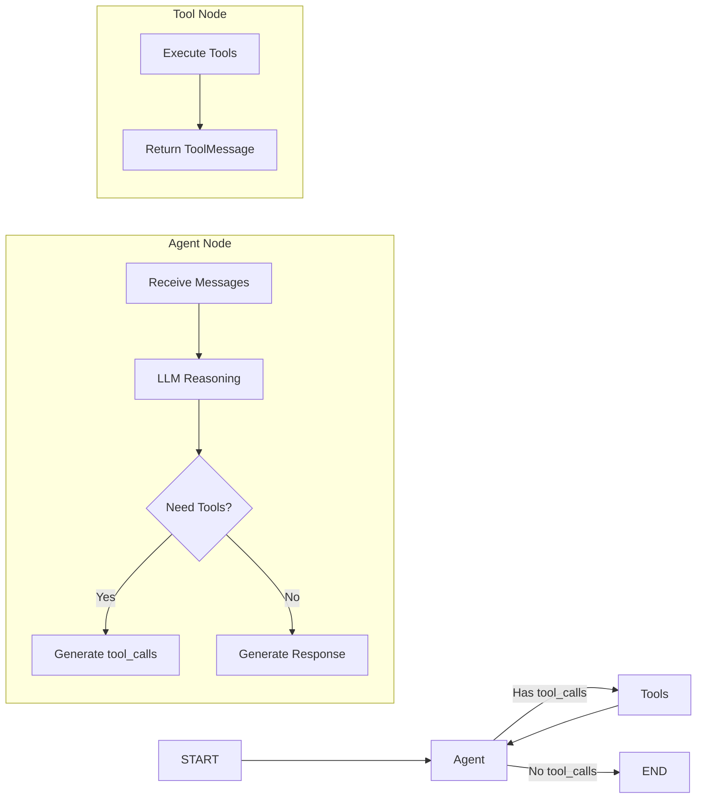

# OmniShopAgent

An autonomous multi-modal fashion shopping agent powered by **LangGraph** and **ReAct pattern**.

## Overview

OmniShopAgent autonomously decides which tools to call, maintains conversation state, and determines when to respond. Built with **LangGraph**, it uses agentic patterns for intelligent product discovery.

**Key Features:**
- Autonomous tool selection and execution
- Multi-modal search (text + image)
- Conversational context awareness
- Real-time visual analysis 

## Tech Stack

| Component | Technology |
|-----------|-----------|
| **Agent Framework** | LangGraph |
| **LLM** | any LLM supported by LangChain |
| **Text Embedding** | text-embedding-3-small |
| **Image Embedding** | CLIP ViT-B/32 |
| **Vector Database** | Milvus |
| **Frontend** | Streamlit |
| **Dataset** | Kaggle Fashion Products |

## Architecture

**Agent Flow:**



**Available Tools:**
- `search_products(query)` - Text-based semantic search
- `search_by_image(image_path)` - Visual similarity search  
- `analyze_image_style(image_path)` - VLM style analysis

## Demo

📄 **[View Full Demo Documentation (PDF)](./demo.pdf)**

## Examples

**Text Search:**
```
User: "winter coats for women"
Agent: search_products("winter coats women") → Returns 5 products
```

**Image Upload:**
```
User: [uploads sneaker photo] "find similar"
Agent: search_by_image(path) → Returns visually similar shoes
```

**Style Analysis + Search:**
```
User: [uploads vintage jacket] "what style is this? find matching pants"
Agent: analyze_image_style(path) → "Vintage denim bomber..."
       search_products("vintage pants casual") → Returns matching items
```

**Multi-turn Context:**
```
Turn 1: "show me red dresses"
Agent: search_products("red dresses") → Results

Turn 2: "make them formal"
Agent: [remembers context] → search_products("red formal dresses") → Results
```

**Complex Reasoning:**
```
User: [uploads office outfit] "I like the shirt but need something more casual"
Agent: analyze_image_style(path) → Extracts shirt details
       search_products("casual shirt [color] [style]") → Returns casual alternatives
```

## Installation

**Prerequisites:**
- Python 3.11+
- OpenAI API Key
- Docker & Docker Compose

### 1. Setup Environment
```bash
# Clone and install dependencies
git clone <repository-url>
cd OmniShopAgent
python -m venv venv
source venv/bin/activate  # Windows: venv\Scripts\activate
pip install -r requirements.txt

# Configure environment variables
cp .env.example .env
# Edit .env and add your OPENAI_API_KEY
```

### 2. Download Dataset
Download the [Fashion Product Images Dataset](https://www.kaggle.com/datasets/paramaggarwal/fashion-product-images-dataset) from Kaggle and extract to `./data/`:

```python
python scripts/download_dataset.py
```

Expected structure:
```
data/
├── images/       # ~44k product images
├── styles.csv    # Product metadata
└── images.csv    # Image filenames
```

### 3. Start Services

```bash
docker-compose up
python -m clip_server
```


### 4. Index Data 

```bash
python scripts/index_data.py
```

This generates and stores text/image embeddings for all 44k products in Milvus.

### 5. Launch Application
```bash
streamlit run app.py
```
Opens at `http://localhost:8501`
